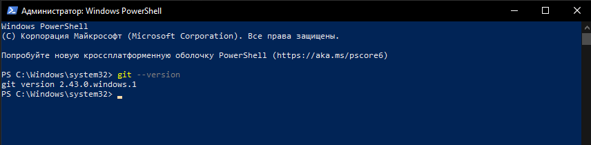
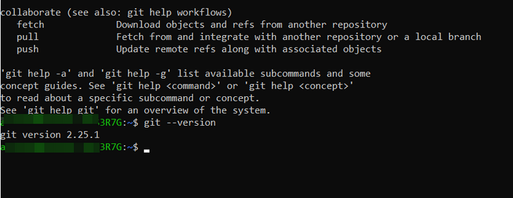

# Установка GIT

## Установка GIT в Windows

Проверка наличия *GIT*:

```bash
 > git --version
```
Если *GIT* уже был установлен, вам отобразится его версия:


Для установки *GIT* перейдите [на страницу](https://git-scm.com/download/win), скачайте подходящий дистрибутив и следуйте инструкциям.

## Установка GIT в Linux Ubuntu (CLI apt)

Проверка наличия *GIT*:

```bash
$ git --version
```


Для установки *GIT* выполните в терминале команду:
```bash
$ sudo apt install git
```
## Установка GIT в MacOS

Проверка наличия *GIT*:

```bash
$ git --version
```
Если *GIT* не установлен, вам будет предложено его установить.

[Главная страница](./readme.md)