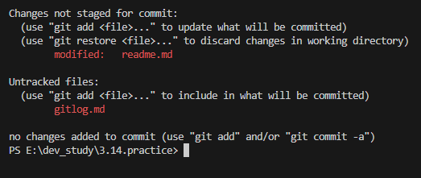
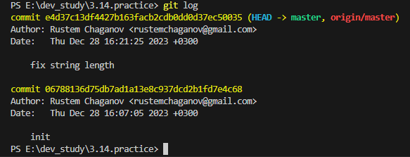
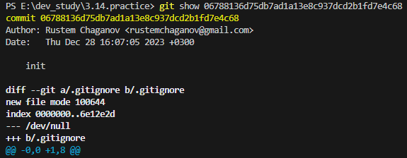

## git status
**git status** - позволяет отследить состояние репозитория. Позволяет узнать, какие изменения необходимо зарегистрировать *Git* (при необходимости — отменить).

## git log
**git log** - покажет список последних коммитов и их хеши SHA1. Список выводится начиная с последнего коммита.

## git show [хэш]
**git show** - [хэш] показывает информацию по определённому коммиту.

[Главная страница](./readme.md)